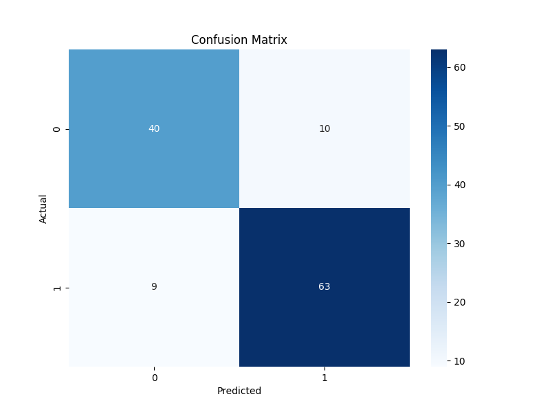

# Heart Disease Prediction Project

## Introduction
This project aims to predict the presence of heart disease using a Logistic Regression model. The analysis involves exploring the dataset, preprocessing the data, training a classification model, and evaluating its performance.

## Data Analysis Key Findings
*   The dataset contains 606 entries and 14 features, with no missing values across any columns. Most features are integers, with 'oldpeak' being a float.
*   Descriptive statistics reveal varying ranges for numerical features; for example, 'age' ranges from 29 to 77, and 'cholesterol' (chol) from 126 to 564.
*   The 'target' variable, indicating the presence (1) or absence (0) of heart disease, shows a moderate imbalance with 330 instances of disease and 276 instances of no disease.
*   Feature distribution analysis, both numerical (e.g., 'age', 'chol', 'thalach') and categorical (e.g., 'sex', 'cp', 'ca', 'thal'), provided insights into their individual distributions and relationships with the target variable.
*   A correlation matrix was generated and visualized, illustrating the linear relationships between all features.

## Data Preprocessing and Model Training
*   Data preprocessing involved one-hot encoding five categorical features ('cp', 'restecg', 'slope', 'ca', 'thal'), resulting in an expanded feature set of 22 columns for modeling.
*   The dataset was split into training (484 samples, 80%) and testing (122 samples, 20%) sets.
*   A Logistic Regression model was successfully trained on the scaled training data. Feature scaling using `StandardScaler` was crucial for model convergence.

## Model Performance Evaluation
The Logistic Regression model achieved the following performance metrics on the test set:

*   **Accuracy**: 84.43%
*   **Precision**: 86.30%
*   **Recall**: 87.50%
*   **F1-score**: 86.90%
*   **ROC AUC Score**: 83.75%

The confusion matrix is visualized below:

### Confusion Matrix

The confusion matrix shows 63 true positives (correctly predicted disease), 40 true negatives (correctly predicted no disease), 10 false positives (predicted disease, but no disease), and 9 false negatives (predicted no disease, but disease present).

## Insights and Next Steps
*   The Logistic Regression model demonstrates good overall performance in predicting heart disease, with a strong balance between precision and recall, indicating its effectiveness in identifying true positive cases while keeping false positives relatively low.
*   To potentially enhance model performance, explore advanced machine learning algorithms (e.g., Random Forest, Gradient Boosting), perform feature engineering to create more informative features, or conduct hyperparameter tuning to optimize the current Logistic Regression model.
